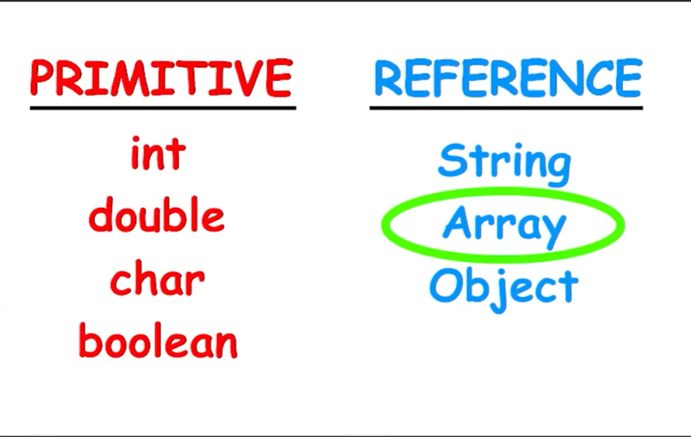

# Programming_Java
## Programming languages:
### Compiled
The whole code >> Compiler >> converted to a machine code 0101
ex: C++, C
### Interpreted
Each line of code >> Interpreter >> excuted line by line
ex: Python, Javascript, C#
>Java
  
Java is known as a compiler-interpreter language because it uses both compilation and interpretation to execute a program. Instead of directly converting source code into machine code, Java follows a two-step execution process, which makes it platform-independent and flexible.

Java programs are executed in the following steps:
Java source code is written in a file with a .java extension.
The Java Compiler (javac) compiles the source code into an intermediate form called bytecode.
Bytecode is stored in a .class file.
The Java Virtual Machine (JVM) interprets or just-in-time compiles this bytecode into machine code that the system can execute.
Role of Bytecode in Java:
Bytecode is platform-independent.
It is not specific to any operating system or processor.
JVM acts as a bridge between bytecode and machine code.
This design enables Java’s “Write Once, Run Anywhere” principle.  

